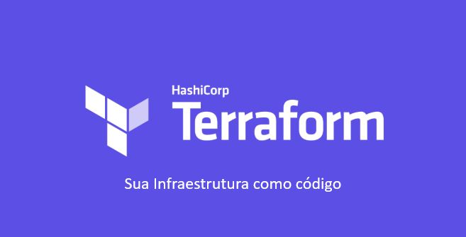

<p align="center">
  
</p>

<h1 align="center">Welcome to Terraform Gitlab Variables Repository</h1>

<p align="center">
  <strong>This is a simple Terraform script that uses the GitLab provider to set variables at the group and project level</strong>
</p>

<p align="center">
  <a href="https://github.com/lpmatos/terraform-gitlab-variables">
    
  </a>

  <a href="https://github.com/lpmatos/terraform-gitlab-variables/graphs/contributors">
    
  </a>

  <a href="https://github.com/lpmatos/terraform-gitlab-variables">
    
  </a>

  <a href="https://github.com/lpmatos/terraform-gitlab-variables">
    
  </a>

  <a href="https://github.com/lpmatos/terraform-gitlab-variables/stargazers">
    
  </a>

  <a href="https://github.com/lpmatos/terraform-gitlab-variables/commits/master">
    
  </a>

  <a href="https://github.com/lpmatos/terraform-gitlab-variables">
    
  </a>

  <a href="https://github.com/lpmatos/terraform-gitlab-variables/issues">
    
  </a>

  <a href="https://github.com/lpmatos/terraform-gitlab-variables/blob/master/LICENSE">
    
  </a>
</p>

### Menu

<p align="left">
  <a href="#pre-requisites">Pre-Requisites</a>&nbsp;&nbsp;&nbsp;|&nbsp;&nbsp;&nbsp;
  <a href="#description">Description</a>&nbsp;&nbsp;&nbsp;|&nbsp;&nbsp;&nbsp;
  <a href="#how-to-contribute">How to contribute</a>
</p>

### By me a coffe

Pull requests are welcome. If you'd like to support the work and buy me a ☕, I greatly appreciate it!

<a href="https://www.buymeacoffee.com/EatdMck" target="_blank"></a>

### Getting Started

If you want use this repository you need to make a **git clone**:

```bash
git clone --depth 1 https://github.com/lpmatos/terraform-gitlab-variables.git -b master
```

This will give access on your **local machine**.

### Pre-Requisites

To this project you yeed:

* Terraform

### Built with

- [Terraform](https://www.terraform.io/docs)

### How to use it?

1. Set the terraform variables.
2. Run Init, Validate, Plan and Apply.
3. Profit.

### Description

Terraform is a tool for building, changing, and versioning infrastructure safely and efficiently. Terraform can manage existing and popular service providers as well as custom in-house solutions.

Configuration files describe to Terraform the components needed to run a single application or your entire datacenter. Terraform generates an execution plan describing what it will do to reach the desired state, and then executes it to build the described infrastructure. As the configuration changes, Terraform is able to determine what changed and create incremental execution plans which can be applied.

The infrastructure Terraform can manage includes low-level components such as compute instances, storage, and networking, as well as high-level components such as DNS entries, SaaS features, etc.


### Usage


* <kbd>terraform init</kbd> - Install dependencies
* <kbd>terraform validade</kbd> - Validate Terraform
* <kbd>terraform plan</kbd> - Test and Validate the deploy Terraform
* <kbd>terraform apply</kbd> - Deploy Terraform

### YAML File

```yml
token: "<GITLAB_TOKEN>"
enable_gitlab_group_variables: false
group: "<GITLAB_GROUP_NAME>"
project: "<GITLAB_PROJECT_NAME>"
envs:
    A: "A"
    B: "B"
    C: "C"
```

### How to contribute

>
> 1. Make a **Fork**.
> 2. Follow the project organization.
> 3. Add the file to the appropriate level folder - If the folder does not exist, create according to the standard.
> 4. Make the **Commit**.
> 5. Open a **Pull Request**.
> 6. Wait for your pull request to be accepted.. 🚀
>
Remember: There is no bad code, there are different views/versions of solving the same problem. 😊

### Add to git and push

You must send the project to your GitHub after the modifications

```bash
git add -f .
git commit -m "Added - Fixing somethings"
git push origin master
```

### Versioning

- [CHANGELOG](CHANGELOG.md)

### License

Distributed under the MIT License. See [LICENSE](LICENSE) for more information.

### Author

👤 **Lucca Pessoa**

Hey!! If you like this project or if you find some bugs feel free to contact me in my channels:

> * Email: luccapsm@gmail.com
> * Website: https://github.com/lpmatos
> * Github: [@lpmatos](https://github.com/lpmatos)
> * LinkedIn: [@luccapessoa](https://www.linkedin.com/in/lucca-pessoa-4abb71138/)

### Show your support

Give a ⭐️ if this project helped you!

### Project Status

* ✔️ Finish

---

<p align="center">Feito com ❤️ by <strong>Lucca Pessoa :wave:</p>
